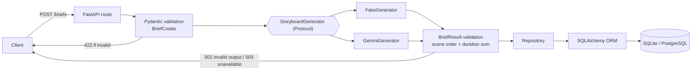
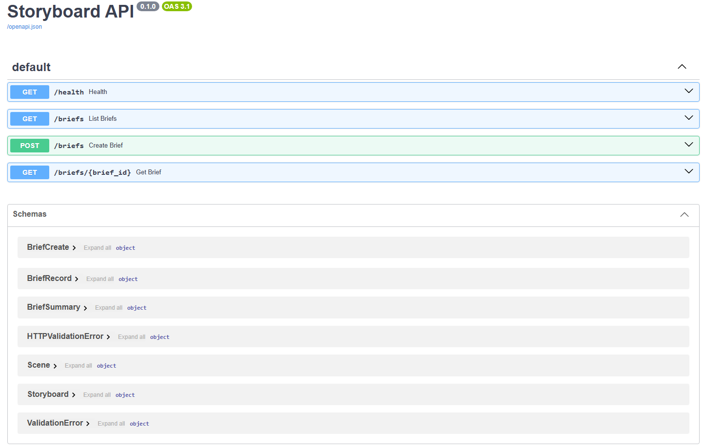

# storyboard-api

> **TODO (CI badge):** this repository has no Git remote yet. After pushing to GitHub, add:
> ``

## Resumo em português

API em FastAPI que recebe o brief de um vídeo publicitário curto (produto, público, tom e
duração) e devolve um roteiro em cenas, salvo no banco. O roteiro vem de um gerador
determinístico (padrão, sem chave) ou do Gemini, com saída estruturada em JSON. Toda saída
do gerador é validada antes de ser gravada: se for inválida a API responde 502, e se o LLM
estiver indisponível responde 503. Roda localmente com SQLite ou via Docker Compose com
PostgreSQL, e tem testes automatizados no GitHub Actions.

---

A FastAPI service that turns a short video-ad brief into a validated, persisted
scene-by-scene storyboard, generated either by a deterministic template or by Google Gemini.

## Features

- `POST /briefs` validates a brief, generates a storyboard and saves both; `GET /briefs`
  and `GET /briefs/{id}` read them back.
- Strict contracts with Pydantic: field limits, scenes numbered 1..N, and scene durations
  that must add up exactly to the brief's duration.
- Pluggable generator: a deterministic **fake** (default, no key, no network) or **Gemini**
  with structured JSON output, one validation-feedback retry and clear error mapping
  (`502` invalid output, `503` unavailable).
- SQLAlchemy 2.0 persistence, database chosen by `DATABASE_URL`: SQLite locally,
  PostgreSQL in Docker Compose.
- pytest suite (schemas, generator, Gemini with a simulated client, repository, API) that
  runs on an in-memory database and never touches the network; GitHub Actions CI.

## Architecture



The route only wires things together: it gets the database session and the generator
through `Depends`, so both can be swapped in tests via `app.dependency_overrides`.

## Project structure

```
storyboard-api/
├── app/
│   ├── main.py              # FastAPI app, lifespan, routes and error mapping
│   ├── config.py            # Settings (pydantic-settings): DATABASE_URL, GENERATOR, GEMINI_*
│   ├── dependencies.py      # get_generator(): picks Fake or Gemini from settings
│   ├── schemas.py           # Pydantic API contracts and cross-field validators
│   ├── models.py            # SQLAlchemy ORM tables (briefs, scenes)
│   ├── db.py                # engine factory, session factory, get_db()
│   ├── repository.py        # data access with select()
│   ├── mappers.py           # ORM rows -> API schemas
│   └── services/
│       ├── base.py          # StoryboardGenerator Protocol, GeneratorError
│       ├── storyboard.py    # FakeGenerator (deterministic)
│       └── gemini.py        # GeminiGenerator (google-genai SDK)
├── tests/                   # pytest suite (in-memory SQLite, no network)
├── docs/                    # screenshots (TODO: added manually)
├── .github/workflows/ci.yml
├── Dockerfile
├── docker-compose.yml
├── .env.example
├── requirements.txt
├── requirements-dev.txt
└── pytest.ini
```

## API

| Method | Path | Success | Errors |
|---|---|---|---|
| `GET` | `/health` | `200` `{"status": "ok"}` | |
| `POST` | `/briefs` | `201` `BriefRecord` | `422` invalid brief · `502` generated storyboard failed validation · `503` generator unavailable |
| `GET` | `/briefs` | `200` list of `BriefSummary`, newest first | |
| `GET` | `/briefs/{brief_id}` | `200` `BriefRecord` | `404` `{"detail": "Brief not found"}` |

Interactive docs: http://localhost:8000/docs



> **TODO:** `docs/screenshot-docs.png` will be added manually (screenshot of `/docs`).

Example (fake generator):

```bash
curl -X POST http://localhost:8000/briefs \
  -H "Content-Type: application/json" \
  -d '{"product_name": "Brew Box", "audience": "remote workers", "tone": "casual", "duration_seconds": 32}'
```

```json
{
  "id": 1,
  "created_at": "2026-10-04T22:23:21.381752Z",
  "brief": {"product_name": "Brew Box", "audience": "remote workers", "tone": "casual", "duration_seconds": 32},
  "storyboard": {
    "scenes": [
      {"order": 1, "duration_seconds": 10, "visual": "Opening shot introducing Brew Box with a casual look and feel.", "narration": "Hey remote workers, meet Brew Box."},
      {"order": 2, "duration_seconds": 10, "visual": "Brew Box in use, showing how it fits ...", "narration": "See how Brew Box makes a difference ..."},
      {"order": 3, "duration_seconds": 12, "visual": "Close-up of Brew Box with logo ...", "narration": "Try Brew Box today."}
    ]
  }
}
```

## Running

### Locally (venv + SQLite)

Requires Python 3.11+.

```bash
python -m venv .venv
.venv\Scripts\activate        # Windows (use `source .venv/bin/activate` on Linux/macOS)
pip install -r requirements.txt
uvicorn app.main:app --reload
```

Run it from the project root: the default `DATABASE_URL` (`sqlite:///./storyboard.db`)
is relative to the working directory. Tables are created on startup.

### With Docker Compose (PostgreSQL)

```bash
docker compose up --build
```

This starts PostgreSQL 18 (data in the named volume `pgdata`) and the API on
http://localhost:8000. The API waits for the database healthcheck (`pg_isready`).
`docker compose down` keeps the data; `docker compose down -v` deletes it.

The `POSTGRES_*` credentials in `docker-compose.yml` are **local development values
only**, not secrets; don't reuse them anywhere else. A `.env` file is optional
(`required: false`) and is used only for `GENERATOR` / `GEMINI_*`; compose always
overrides `DATABASE_URL` to point at its own database. Requires Docker Compose 2.24+.

## Choosing the generator

Storyboards come from one of two generators, selected by the `GENERATOR` setting:

| `GENERATOR` | What it does | Needs a key? |
|---|---|---|
| `fake` (default) | Deterministic template: 3 scenes, no network | No |
| `llm` | Google Gemini via the `google-genai` SDK, structured JSON output | Yes |

The default is `fake`, so the API runs out of the box with no key and no network.

To use Gemini:

1. Create a free API key in Google AI Studio: https://aistudio.google.com/apikey
2. Copy `.env.example` to `.env` and fill it in:
   ```bash
   cp .env.example .env
   ```
   ```dotenv
   GENERATOR=llm
   GEMINI_API_KEY=<your key>
   GEMINI_MODEL=gemini-3.5-flash-lite
   LLM_TIMEOUT_SECONDS=20
   ```
3. Restart the server. With `GENERATOR=llm` and no `GEMINI_API_KEY`, startup fails
   with a clear error.

`.env` is git-ignored; never commit it. Environment variables override `.env`.

If the model's output fails validation (bad JSON, scene durations that don't add up),
the generator retries once with the error in the prompt; if it fails again the API
answers `502`. Rate limits (429), timeouts and network errors answer `503`. Nothing is
saved in either case.

> **Free tier caveats.** Gemini free-tier limits (requests per minute/day, available
> models) vary and change over time, so expect occasional `503`s under load. Free-tier
> prompts may be used by Google to improve its products: **do not send confidential
> data from real campaigns** (unreleased products, client names, budgets) on the free tier.

## Tests

```bash
pip install -r requirements-dev.txt
pytest -v
```

The suite uses an in-memory SQLite database (`StaticPool`) built with the same engine
factory as the app (foreign keys on), forces `GENERATOR=fake`, and replaces the Gemini SDK
client with a fake: it never touches `storyboard.db`, never needs an API key and never
calls the network. CI runs the same command on every push and pull request.

## Design decisions

- **Validation at the edge.** Pydantic rejects bad input with `422` before any logic runs,
  and the generated storyboard is validated again (`BriefResult`) before anything is saved.
  A rule like "durations must add up" lives in one validator and is reused, not duplicated.
- **ORM and Pydantic are separate classes.** ORM models describe storage (tables, foreign
  keys, internal ids); schemas describe the public contract. Each can change without
  breaking the other, and internal columns never leak into responses by accident.
- **Generator behind an interface, fake by default.** Routes depend on a `Protocol`, not on
  Gemini. The deterministic fake keeps the project runnable and testable with no key, no
  cost and no data leaving the machine; the LLM is an explicit opt-in.
- **LLM output is untrusted.** It is parsed and validated like user input. Invalid output
  gets one retry with the validation error as feedback, then `502`; rate limits, timeouts
  and network errors become `503`. The API key is a `SecretStr` and is never logged.
- **Database-agnostic via `DATABASE_URL`.** The same code runs on SQLite (local, tests) and
  PostgreSQL (compose); SQLite-only tweaks are applied only to SQLite URLs.

## Limitations and next steps

- **Migrations:** tables are created with `create_all` on startup; move to Alembic.
- **Authentication:** the API is open; add API keys or OAuth before exposing it.
- **Rate limiting:** nothing protects the (paid or quota-limited) LLM from abuse.
- **Async:** routes and the Gemini client are synchronous; consider async SQLAlchemy and
  the SDK's async client for higher concurrency.
- **Structured logs:** plain-text logging today; move to JSON logs with request ids.
- **Postgres in CI:** CI runs on SQLite only; add a Postgres service job.
- **Gemini SDK:** the current Gemini docs feature the new `client.interactions` API; this
  project uses the stable `client.models.generate_content`. Evaluate migrating.
